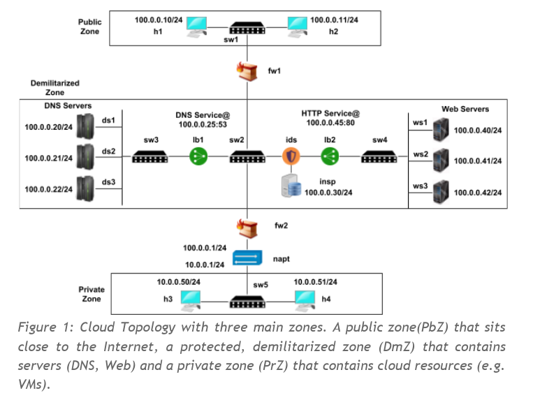

# ik2220-SDN-NFV
## Software Defined Networking & Network Function Virtualization
### POX Controller, Mininet & Click Modular Router

Here the topology:



1. Open two different terminal.
2. Launch the POX Controller with:
	```
	$ sudo make app
	```
3. Launch the Mininet topology
	```
	$ sudo make topo
	```

To close just Ctrl+C or `sudo make clean`


### Important files
- **topology/sdn_assign2.py**: main Mininet script with Topology and Tests. It launches the WEB and DNS on the servers, assign DPIDS to every device and save report to the _report/_ folder.
- **application/**: contains two folders, **nfv/** and **sdn/**.
- **application/nfv**: containts Click Modular Router configurations for the devices
- **application/sdn/**: contains the POX controller under **ext/**